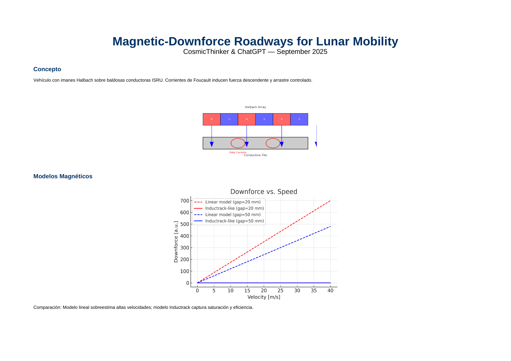

# Magnetic Downforce Roadways for Lunar Mobility

Unified dossier on the concept of **magnetic-downforce roadways** for lunar mobility, integrating versions v0.1–v0.5.  
Authors: **CosmicThinker & ChatGPT**  
Date: **30 September 2025**  

---

## Visual Overview

👉 For full technical details, see the dossier:  
[📄 Magnetic_Downforce_Roadways_v0.5_final.pdf](Magnetic_Downforce_Roadways_v0.5_final.pdf)

---

## Executive Summary

- Downforce per module: **3–5 kN** at 10–30 m/s  
- Drag energy: **~270 Wh/km** @ 20 m/s (gap=20 mm)  
- Radiators: **~20 kW → 30 m²** @ 350 K  
- Nonlinear Inductrack-like model captures **v² growth, saturation, drag peaking, roll-off**  
- **ISRU viability**: ~117 t regolith/km → 7 t Al/km + 8 t O₂ coproduct  
- **Energy cost**: ~37 MWh/km (~2–3 days of a 40 kW reactor)  
- **Production time**: ~12 days/km with 1 reactor, <1 week/km with 2–4 reactors  
- **ROI < 1 lunar year** for corridors 10–50 km  

---

## Key Results

| Magnitude             | Value (typical)                 |
|-----------------------|---------------------------------|
| Downforce             | 3–5 kN/module                   |
| Drag energy           | 270 Wh/km @20 m/s               |
| Radiators             | 20 kW → 30 m² @350 K            |
| ISRU Al               | 7 t/km (117 t regolith)         |
| Coproducts            | 8 t O₂ + 30–50 t slag           |

---

## Appendix A — ISRU Simulations

- **Regolith required**: 88–176 t/km (depending on Al content and efficiency)  
- **Energy cost**: 33–53 MWh/km  
- **Production time**: 9–18 days/km (1 reactor), <1 week/km (2–4 reactors)  
- **Coproducts**: 8–10 t O₂/km, 30–50 t slag/km  
- **Challenges & improvements**: beneficiation (+10–20% efficiency), thermal management (1900–2200 K, YSZ insulation), integration with slag paving  

Figures included in the dossier:  
- Regolith vs. extraction efficiency  
- Energy vs. efficiency  
- Duration vs. reactors  
- Average power & radiator area vs. reactors  

---

## Bibliography

- Post, R. F., & Ryutov, D. D. (1996). *The Inductrack: A Simpler Approach to Magnetic Levitation*. LLNL.  
- Post, R. F. (2000). *The Inductrack Approach to Magnetic Levitation*. U.S. DOE.  
- Post, R. F. (2004). *A Laminated Track for the Inductrack System: Theory and Experiment*. LLNL.  
- Post, R. F. (2008). *The Design of Halbach Arrays for Inductrack Maglev Systems*. OSTI.  
- Meng, X., et al. (2022). *Research on Gravity Compensation System of Planetary Rover Based on Electrodynamic Suspension*.  
- Hintz, A., et al. (2023). *Laser Melting Manufacturing of Large Elements of Lunar Regolith Simulant*. *Scientific Reports*.  
- Taylor, L. A., et al. (2020). *Microwave Sintering Lunar Landing Pads & Horizontal Infrastructure*. NASA TRS.  
- Ortiz Gómez, N. (2017). *Eddy Currents Applied to Space Debris Objects*. ePrints Soton.  

---

## Acknowledgements

This dossier also benefited from iterative feedback by **Grok (xAI)**, whose evaluations helped refine the document.

---

## Tags

#LunarMobility #MagneticRoadways #Inductrack #Halbach #ISRU #MoonInfrastructure #Artemis #SpaceEngineering #Maglev #Downforce #SpaceResources #CosmicThinker
